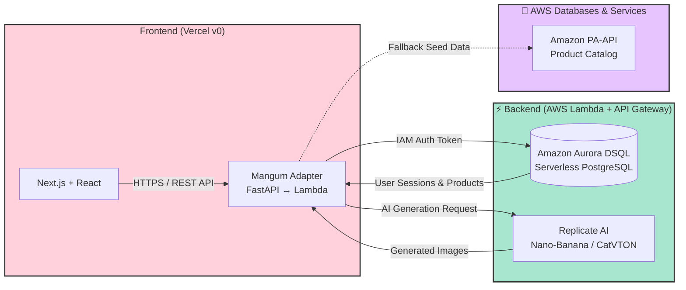

# MIRRA: AI-Powered Fashion Visualization Platform

**Track 1: Monetizable B2C App | H0: Hack the Zero Stack**

MIRRA solves the fundamental trust gap in online fashion shopping by enabling users to visualize clothing and accessories before purchasing. Built entirely on the **Vercel v0 + AWS Databases** zero-stack architecture, MIRRA delivers photorealistic AI try-ons and real-time AR experiences with serverless scalability and minimal operational overhead.

## 🎯 Problem & Solution

-   **The Problem:** Online shoppers cannot visualize how items will look on them, leading to purchase hesitation and high return rates.
-   **The User:** Everyday consumers and content creators seeking confident, visual-first outfit discovery.
-   **The Solution:** A frictionless studio that combines AI garment generation with seamless product exploration — no enterprise tools, no subscriptions, just instant visual confidence.

##  Key Features

-   **AI Precision Try-On:** Photorealistic clothing visualization using Google Nano-Banana (Gemini 2.5) that preserves pose, lighting, and background.
-   **Curated Product Catalog:** Seamless integration with Amazon India for instant product exploration and purchase.
-   **Creator History:** Persistent session storage powered by AWS Aurora DSQL for personalized style tracking.
-   **Zero-Friction Access:** Instant sign-up via Clerk Auth with automatic PRO tier access for all new users.

## 🏗️ Architecture

MIRRA is built on a true zero-stack serverless architecture designed for cost efficiency and global scalability:

### Why This Stack?

-   **Amazon Aurora DSQL:** Scales to zero during idle periods (<$0.50/month off-peak), uses IAM authentication for credential-free security, and integrates natively with Lambda.
-   **AWS Lambda + API Gateway:** Event-driven backend that only incurs costs during active user sessions. No cold-start delays for subsequent requests.
-   **Vercel v0:** Global CDN ensures instant page loads worldwide, directly impacting user conversion and engagement.
-   **Replicate AI:** Pay-per-generation model aligns infrastructure spend directly with user activity.

## 🛠️ Tech Stack

| Layer | Technology | Purpose |
| :--- | :--- | :--- |
| Frontend | Next.js, React, Tailwind CSS, Framer Motion | Responsive UI with glassmorphic design |
| Authentication | Clerk | Secure OAuth + Email/Password auth |
| Backend | Python FastAPI, Mangum, Uvicorn | Serverless API gateway adapter |
| Database | Amazon Aurora DSQL | Serverless PostgreSQL for users & sessions |
| AI Engine | Replicate (CatVTON) | Photorealistic virtual try-on generation |
| Commerce | Amazon PA-API + Seed Data Fallback | Product catalog & affiliate integration |
| Hosting | Vercel (Frontend) + AWS Lambda (Backend) | True zero-stack deployment |
